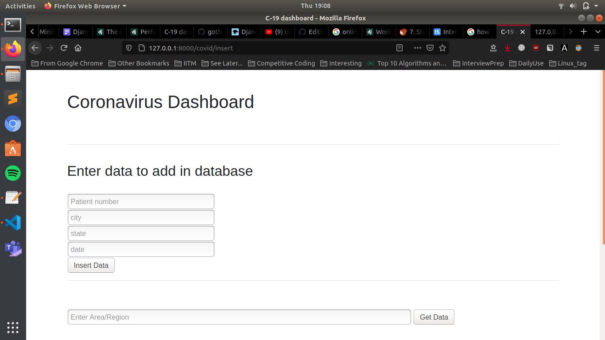
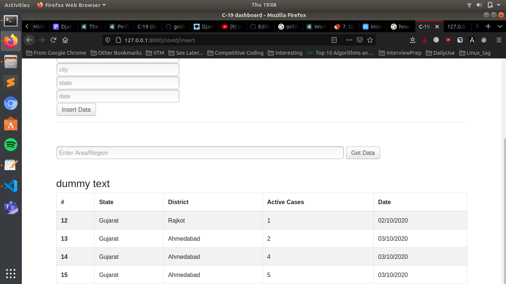

# Description 
1. A covid dashboard that contains data of covid +ve patients of each district and state of India.
2. Request specific states or districts data of covid patients using the front end. This retrieves the rows of data from our database using the GET request from the django.
3. A table is created to display this list of data retrieved.
4. Connected the PostgreSQL database with my django framework to add or retrieve data through POST/GET requests.

## PDF link (Desription of project for evaluation) :
[Click Here](https://docs.google.com/document/d/1cmxMSx72kc69ZoNLRwZu_zN3W1mxVUbYnhy27kgk1cE/edit?usp=sharing)

## Screenshot 1 (Home Page)

## Screenshot 2 (Home Page)

 
